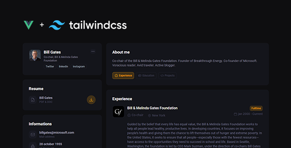

    

    
    
    

#### About

This is a template for you if you want to put your resume online to share it easily with future employers or clients!

See [Demo](https://vue-resume-six.vercel.app) page.

#### Versions
 

#### Commands

| command | What it does? | 
| ------- | :------------ | 
| `npm run dev` | Starts the server in dev mode |
| `npm run lint` | Runs ESLint on project |
| `npm run prettier` | Runs prettier on entire src folder |
| `npm run prettier:verify` | Runs prettier-check and throws error if fails |
| `npm run prettier:staged` | Runs prettier on only staged (changed) files |

#### Dependencies

| Package | What it does? | Link |
| ------- | :------------ | :----|
| `@headlessui/vue` | A set of completely unstyled, fully accessible UI components for Vue 3, designed to integrate beautifully with Tailwind CSS. | [Here](https://headlessui.com/) |
| `@heroicons/vue` | Beautiful hand-crafted SVG icons, by the makers of Tailwind CSS. | [Here](https://heroicons.com/)|
| `vue-easy-lightbox` | A Vue.js 3.0 image lightbox component with Zoom / Drag / Rotate / Switch . | [Here](https://www.npmjs.com/package/vue-easy-lightbox)|
| `vue-i18n` | Vue I18n is internationalization plugin for Vue.js | [Here](https://kazupon.github.io/vue-i18n/)|

#### Dev Dependencies

| Package | What it does? | Link |
| ------- | :------------ | :----|
| `prettier` | An opinionated code formatter | [Here](https://www.npmjs.com/package/prettier)|
| `prettier-plugin-tailwindcss` | A Prettier plugin for Tailwind CSS that automatically sorts classes based on our recommended class order | [Here](https://www.npmjs.com/package/prettier-plugin-tailwindcss)|
| `tailwindcss` | A utility-first CSS framework for rapidly building custom user interfaces. | [Here](https://www.npmjs.com/package/tailwindcss)|

#### Icons
This project use [Hero Icons](https://heroicons.com/)

#### Disclaimer
The Tailwind name and logos are trademarks of Tailwind Labs Inc.
The Vue name and logos are trademarks of Vue.
